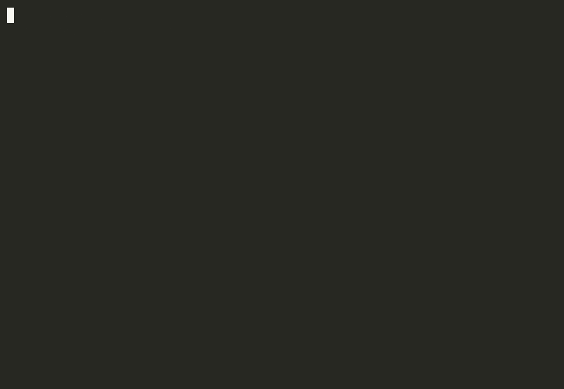

# esig-suite — self-contained PDF e-signature SDK

[](https://github.com/vmvtech/esig-suite/actions/workflows/publish.yml)
[](https://www.npmjs.com/package/@e-sig/core)
[](https://www.npmjs.com/package/@e-sig/supabase)
[](https://www.npmjs.com/package/@e-sig/react)
[](./LICENSE)
[](https://github.com/vmvtech/esig-suite/stargazers)
[](https://nodejs.org)

A portable, **self-hosted** PDF e-signature stack: render an HTML document to
PDF, sign it with a self-issued per-tenant certificate (PKCS#7 / ETSI CAdES,
optional RFC-3161 trusted timestamp → CAdES-T), store it, and keep an
append-only attribution log. **No SaaS, no metering, no per-document fees** — you
own the certs, the PDFs, and the audit trail.

Extracted from the Opendelphi production pipeline (live since 2026-05).

## Packages

| Package | What | Stack |
|---|---|---|
| **`@e-sig/core`** | The engine: `renderHtmlToPdf` → `signPdf` (+TSA) → `verifyPdfSignature`, self-signed cert issuance, multi-signer **envelopes** with single-use tokenized signing links, the `CertStore`/`AuditLogStore`/`PdfStorageStore`/`EnvelopeStore` interfaces, filesystem adapters (`@e-sig/core/fs`), `ensureActiveCert`, and the end-to-end `signDocument()` orchestrator. | Node, stack-agnostic |
| **`@e-sig/supabase`** | Reference adapters: `SupabaseCertStore`, `SupabaseAuditLogStore`, `SupabasePdfStorageStore`. | Supabase (Postgres + Storage) |
| **`@e-sig/react`** | UI: `SignaturePadCanvas` (draw-to-sign), `SelfSignFlow`, `SelfSignedReceipt`. | React 18/19 |
| **`@e-sig/uuaid`** | **Opt-in**: `withUuaidActor` stamps the acting agent's [UUAID](https://uuaid.org) into the audit log; `anchorChainHead` anchors the audit hash-chain head to UUAID's Polygon-anchored ledger (encrypted, hash-only — no document content leaves your infra). Core stays SaaS-free without it. | UUAID (optional) |

Plus **`migrations/`** (a `tenant_id`-keyed schema bundle) and a **Next.js +
Supabase starter** under `examples/nextjs-supabase`.

## Quickstart (60 seconds, no services)

Issue a cert → sign a PDF → verify → detect tampering, with nothing but Node:

```bash
git clone https://github.com/vmvtech/esig-suite && cd esig-suite
npm install && npm run build && npm run quickstart
```



Or copy [`examples/quickstart`](examples/quickstart) into your own project —
one file, one dependency (`@e-sig/core`), no database or browser required.

## Quickstart (Next.js + Supabase)

```bash
npm i @e-sig/core @e-sig/supabase @e-sig/react
```

1. **Migrate** — apply `migrations/0001_esig_self_contained.sql` and replace the
   `esig_tenant_member()` stub with your tenant-membership check. (See
   `migrations/README.md`.)
2. **Wire the sign route** — load your document, compose the signature-embedded
   HTML, call `signDocument()` over the three Supabase stores, persist the result:
   ```ts
   import { signDocument } from "@e-sig/core";
   import { SupabaseCertStore, SupabaseAuditLogStore, SupabasePdfStorageStore } from "@e-sig/supabase";

   const result = await signDocument({
     html, signatureImage: { bytes, contentType: "image/png" },
     tenantId, subjectName: tenantName, passphrase: process.env.ESIG_CERT_PASSPHRASE!,
     signer: { name, email }, actorUserId,
     certStore: new SupabaseCertStore(service),
     auditStore: new SupabaseAuditLogStore(service),
     storage: new SupabasePdfStorageStore(service),
     pathPrefix: `${tenantId}/${documentId}`,
     targetTable: "documents", targetId: documentId,
   });
   // → { signedPdfUrl, auditLogId, certFingerprint, timestamped }
   ```
3. **Mount the UI** — `<SelfSignFlow documentId signer preview signEndpoint onSigned />`,
   then `<SelfSignedReceipt … />` once signed.

The full wiring is in `examples/nextjs-supabase/`.

## Bring your own stack

`signDocument()` depends only on the three interfaces in
`@e-sig/core/adapters` — implement them against any DB/storage (the
Supabase package is just the reference). The React components take a `signEndpoint`
+ callbacks and have no Next/Supabase coupling. The migration is `tenant_id`-keyed
with a single tenant-access predicate to replace.

## Legal posture

The signing path targets ESIGN/UETA: intent (consent checkbox), attribution
(`esig_audit_log` — actor, IP, UA, cert fingerprint), and integrity (PKCS#7
detached signature, optional RFC-3161 timestamp). You remain responsible for
your own compliance review.

## Build (workspace)

```bash
npm install
npm run build     # builds core → supabase → react in dep order
npm run smoke     # Chrome-free runtime smoke against the built core
```

License: MIT.
